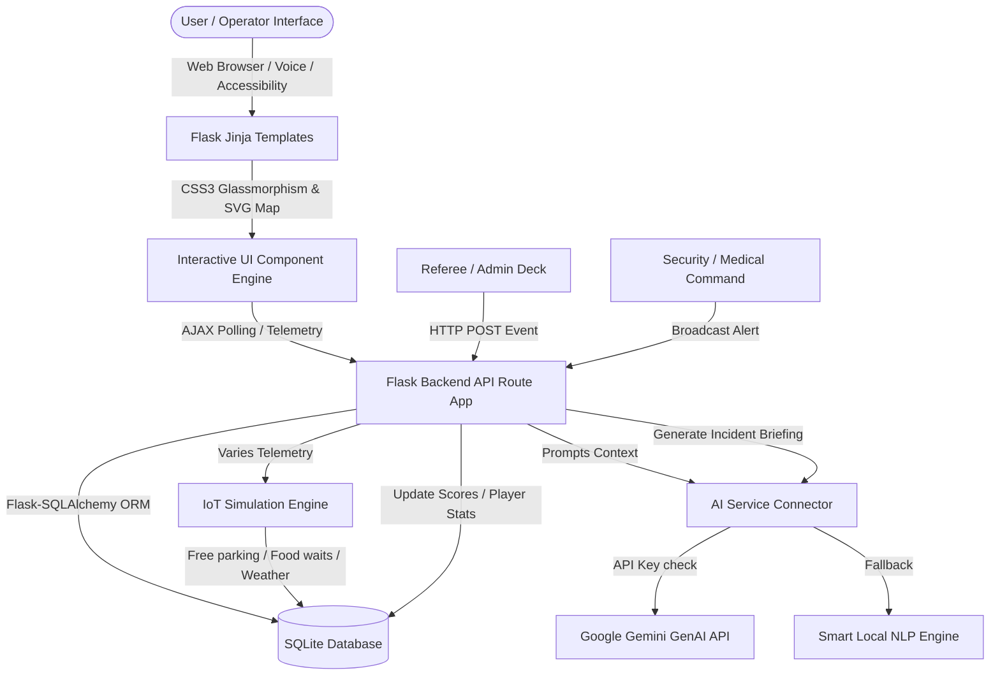

# StadiumGPT 🏟️
### AI-Powered Stadium Operations & Fan Experience Platform (FIFA World Cup 2026)

StadiumGPT is a comprehensive, GenAI-enabled stadium intelligence and operations center designed to optimize crowd safety, coordinate matches, and enrich fan experiences at MetLife Stadium (FIFA Stadium NYNJ) during the FIFA World Cup 2026. 

The application is built on a responsive, dark-mode-first aesthetic with a glassmorphism theme, offering specific workflows for **Fans, Stadium Managers, Security Officers, Medical Teams, Referees, Tournament Admins, and Media Press**.

---

## 🏗️ System Architecture



---

## 🌟 Key Features

1. **👥 Multi-Role Dashboards**: Specific access rights and views tailored for:
   * **Fan**: AI Assistant, Smart Parking, Food pre-orders, Interactive SVG Map, and Tournament scores.
   * **Referee**: Live Match Command deck to log goals, cards, subs, and VAR events.
   * **Security/Medical**: Log incidents, respond to alerts, and view AI commander incident briefings.
   * **Stadium Manager/Admin**: View operational BI metrics, manage emergency alerts, and inspect system audit logs.
   * **Media**: View live match summaries generated by GenAI.
2. **🧠 AI Stadium Assistant (Google Gemini + Smart Local Fallback)**:
   * Dynamic responses about Gate locations, restrooms, wheelchair paths, food recommendations, and transit options.
   * Fully supports **Voice Input** (microphone) and **Voice Output** (vocal responses) via the browser Web Speech API.
3. **🗺️ Interactive Indoor Navigation SVG Map**:
   * Interactive pathfinding vector lines mapping routes from entry gates to seats or facilities.
   * Section congestion highlights (Low/Medium/High occupancy ratings) to guide crowd flow.
   * Proximity detour logic routing around the pitch.
4. **⚽ Live Match Operations**:
   * Referee controls adjust scores and update tournament standings instantly.
   * Match timeline records goals, cards, and VAR reviews.
5. **🚗 Smart Parking & EV Charging**:
   * AI-generated parking recommendations based on ticket entry gates.
   * Real-time EV charging slot occupancy tracking and reservations.
6. **🍔 Smart Food Court Pre-Ordering**:
   * Stall queue wait-time estimation based on active simulation metrics.
   * QR verification code generator upon ordering.
7. **🚨 Emergency Command Center**:
   * Dispatch logs for Medical, Fire, Security, and Equipment alerts.
   * Real-time automated GenAI Incident briefings compiling active stadium alerts into operational instructions.
8. **🌱 Sustainability Metrics**:
   * Telemetry tracker for electricity consumption, water utilization, waste recycling indices, and estimated carbon offsets.
9. **📈 Analytics BI & Audit Logs**:
   * Dynamic Chart.js visualizations for attendance traffic flows and incident types.
   * Read-only operational action audits.
   * CSV exports for Match records, Incident logs, Player stats, and Sustainability metrics.
10. **♿ Advanced Accessibility System**:
    * **High Contrast Mode**: Solid black and white borders for visual impairments.
    * **Text Sizing Console**: Real-time font scaling (A- to A++) persisting across pages.
    * Screen-reader semantic structures (`aria-live`, labels).

---

## ⚙️ Tech Stack

* **Frontend**: HTML5, CSS3 (Vanilla Dark Theme + Glassmorphism), JavaScript (Web Speech API, SVGs), Chart.js, Bootstrap 5.
* **Backend**: Flask (Python) with session role-based filters.
* **Database**: SQLite with Flask-SQLAlchemy ORM.
* **AI Intelligence**: Google Gemini API via `google-generativeai` (with intelligent keyword-based local NLP fallback).
* **Testing**: Pytest (automated integration and unit testing).
* **Deployment**: Docker containerization.

---

## 🚀 Getting Started

### Prerequisites
* Python 3.12+
* Pip package manager

### Installation

1. Clone the repository and navigate to the project directory:
   ```bash
   cd d:/project/stadiumGPT
   ```
2. Install the required Python dependencies:
   ```bash
   pip install -r requirements.txt
   ```
3. *(Optional)* Set your Google Gemini API Key in a `.env` file at the root:
   ```env
   GEMINI_API_KEY=your_actual_gemini_api_key_here
   ```
   *Note: If no API key is provided, the platform automatically activates its built-in rule-based NLP assistant, which provides the exact same operational responses.*

4. Launch the application:
   ```bash
   python app.py
   ```
5. Open your browser and navigate to `http://localhost:5000`

---

## 🔑 Preset Credentials

For testing and demonstration, use these credentials on the login screen (click the auto-fill preset buttons for ease of use):

| Role | Username | Password | Access Highlights |
| :--- | :--- | :--- | :--- |
| **Fan** | `fan1` | `fan` | AI Chat Assistant, Parking recommendations, Food ordering, Maps. |
| **Referee** | `referee1` | `referee` | Log match events (Goals, Cards, VAR), update scores live. |
| **Security Officer** | `security1` | `security` | Log and resolve emergency alerts, view AI Commander briefs. |
| **Medical Team** | `medical1` | `medical` | Monitor injury reports, resolve medical alerts. |
| **Tournament Admin**| `admin1` | `admin` | Full officiating deck, security panels, system audits. |
| **Stadium Manager** | `manager1` | `manager` | Operational charts, system audit trails, CSV downloads. |
| **Media** | `media1` | `media` | AI Match Summaries, stats exports, scores timeline. |

---

## 🧪 Running Tests

A suite of 8 integration and unit tests is included to check database schemas, auth sessions, and NLP fallbacks.

To execute tests:
```bash
python -m pytest
```
All tests run against a clean in-memory database to ensure zero trace configurations.
